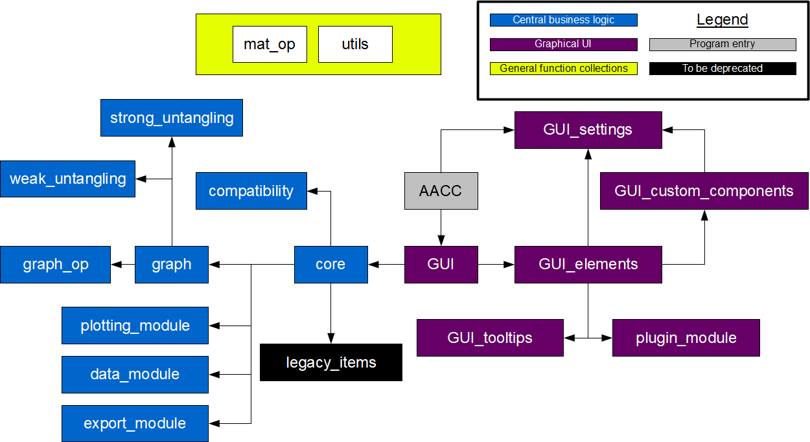

Documentation
---------------------------------------------

The modular structure of AutoAtom is shown below. It has a **core** module that internally acts as an API
for the **GUI**. The **core** module is what controls the project data and workflow. Its main goal is to
translate information from a HAADF-STEM image into lower entropy information in the form of digraph-like *atomic graphs*.
The graphs and related mathematics and data is contained in the **graph** module, which in turn uses
graph operations from the **graph_op** and **untangling** modules. The
**GUI** also relies on a modular hierarchy of increasing level of abstractions. The GUI is built to plug
into the **core** module, but the core module does not know about the GUI. In the image below, arrows
indicate plug-in direction, ie if module **A** points to module **B**, then **A** imports **B**, etc...

    Figure 5.1: Program structure

The function-modules **utils** and **mat_op** are collections of simple functions, and these modules are
used by varying modules throughout the program, wherever it is convenient. They are not really a part of
the modular structure, but instead functions abstracted away for convenience and re-usability.

.. toctree::
    :caption: Modules

    graph
    core
    data_module
    plotting_module
    export_module
    utils
    mat_op
    GUI

